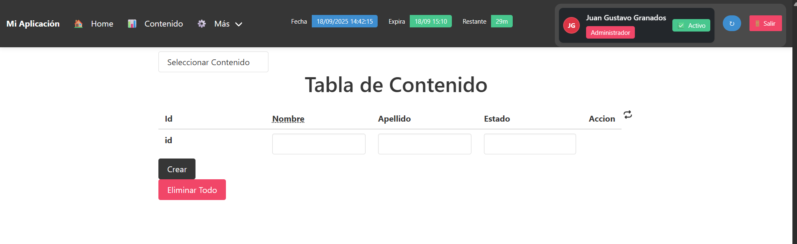

# 🛡️ Proyecto Angular: Autenticación con JWT y Tablas Dinámicas

Este proyecto es una aplicación web desarrollada con **Angular** que implementa un sistema completo de **login** y **registro** de usuarios, utilizando **JWT (JSON Web Tokens)** para la autenticación y autorización. Además, incorpora visualización de datos en **tablas dinámicas**, con una interfaz moderna gracias a **Bulma CSS**.

---

## 🚀 Tecnologías Utilizadas

- **Angular 17** – Framework principal del proyecto.
- **Formulario Reactivo** – Para la gestión y validación de formularios.
- **JWT (jsonwebtoken)** – Para la autenticación basada en tokens.
- **Bulma** – Framework CSS para una interfaz responsive y moderna.
- **AG Grid** – Tabla avanzada para visualización de datos.
- **FontAwesome** – Iconografía moderna y personalizable.
- **Toastr** – Notificaciones elegantes.
- **Ngx-cookie-service** – Gestión de cookies del lado del cliente.

---

## ⚙️ Dependencias Principales

```json
"@angular/core": "^17.3.0",
"@fortawesome/angular-fontawesome": "^0.14.1",
"ag-grid-angular": "^31.3.1",
"bulma": "^0.9.4",
"jwt-decode": "^4.0.0",
"ngx-cookie-service": "^17.1.0",
"ngx-toastr": "^19.0.0",
```

## 🖥️ Captura de pantalla - Interfaz principal


